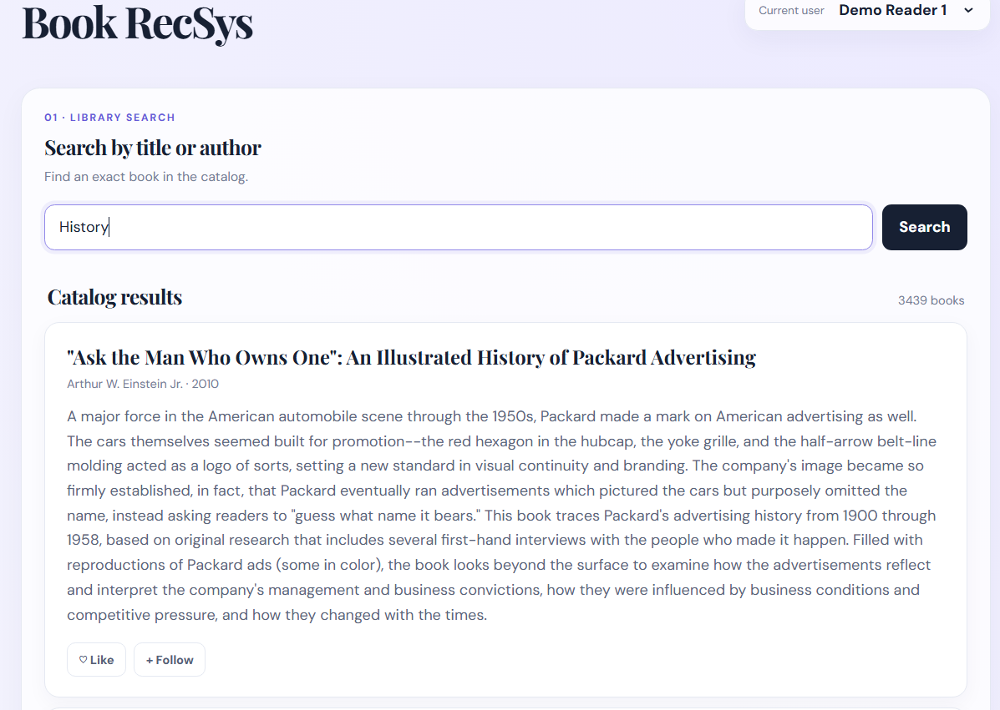
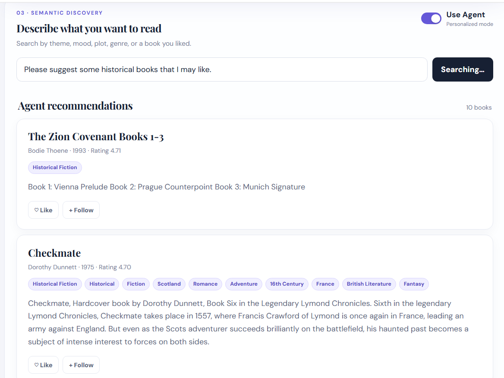

# BookRecSys

BookRecSys is a Goodreads-based book discovery and recommendation application. The project combines a Next.js/React frontend, a FastAPI backend, SQLite, FAISS semantic search, content-based recommendations, and a BookGuide Agent.

## Features

- **Search by title or author**: exact catalog search with pagination.
- **Recommended for you**: recommendations based on the selected user's likes, ratings, follows, and reading activity.
- **Semantic discovery**: search with a natural-language description of a theme, mood, plot, or genre.
  - **Use Agent disabled**: regular semantic search through `/books/recommend`.
  - **Use Agent enabled**: sends the query to `/bookguide`, allowing the agent to combine semantic search with personalization, filtering, and user context.

## Architecture

```text
Browser → Next.js/React → FastAPI
                         ├─ SQLite + SQLAlchemy
                         ├─ Exact title/author search
                         ├─ FAISS + Sentence Transformers
                         ├─ Content-based recommendation
                         └─ BookGuide Agent
```

## Requirements

- Python 3.10+
- Node.js 20+ and npm
- An OpenAI API key or Ollama, depending on the configured provider
- Disk space for the Sentence Transformer model and FAISS index

## Installation

```powershell
cd D:\Projects\BookRecSys
python -m venv .venv
.\.venv\Scripts\Activate.ps1
python -m pip install --upgrade pip
pip install -r backend\requirements.txt

cd frontend
npm.cmd ci
```

If PowerShell blocks the activation script:

```powershell
Set-ExecutionPolicy -Scope Process Bypass
```

Create a `.env` file in the project root:

```env
DATABASE_URL=sqlite:///./data/app/recsys.db
LLM_PROVIDER=api
LLM_MODEL=gpt-4o-mini
OPENAI_API_KEY=your-openai-api-key-here
OLLAMA_BASE_URL=http://localhost:11434
OLLAMA_MODEL=qwen3.5:4b
```

Never commit a real API key.

## Database and index setup

Initialize the database schema:

```powershell
cd D:\Projects\BookRecSys
python backend\scripts\init_db.py
```

Use the following scripts to import books and build the semantic index:

```powershell
python backend\scripts\import_books.py --help
python backend\scripts\build_semantic_index.py --help
```

Create demo users and interaction data:

```powershell
python backend\scripts\create_user.py --help
python backend\scripts\seed_random_users.py
python backend\scripts\simulate_interactions.py
```

## Running the application

Open two terminals.

### Backend

```powershell
cd D:\Projects\BookRecSys
.\.venv\Scripts\Activate.ps1
python -m uvicorn backend.app.main:app --reload --host 0.0.0.0 --port 8000
```

Important URLs:

- API: http://127.0.0.1:8000
- Swagger UI: http://127.0.0.1:8000/docs
- Health check: http://127.0.0.1:8000/health

### Frontend

```powershell
cd D:\Projects\BookRecSys\frontend
npm.cmd run dev
```

Open http://localhost:3000.

To access the frontend from another device on the local network:

```powershell
npm.cmd run dev -- --hostname 0.0.0.0
```

If the backend is not running on localhost, create `frontend/.env.local`:

```env
NEXT_PUBLIC_API_URL=http://192.168.100.37:8000
```

## Main API endpoints

| Method | Endpoint | Purpose |
|---|---|---|
| GET | `/health` | Check backend availability |
| GET | `/users` | List users |
| GET | `/books/search` | Search by title or author |
| POST | `/books/recommend` | Semantic search |
| POST | `/users/{user_id}/recommendations` | Personalized recommendations |
| POST | `/bookguide` | Agent search with personalization |
| POST | `/bookguide/plan` | Inspect the agent's query plan |
| PUT | `/interactions` | Save like, dislike, or follow interactions |
| PUT | `/ratings` | Save a 1–5 rating |

Example semantic search request:

```powershell
Invoke-RestMethod http://127.0.0.1:8000/books/recommend -Method Post `
  -ContentType 'application/json' `
  -Body '{"query":"a dark political science-fiction novel","user_id":"DEMO01","top_k":10}'
```

Example BookGuide Agent request:

```powershell
Invoke-RestMethod http://127.0.0.1:8000/bookguide -Method Post `
  -ContentType 'application/json' `
  -Body '{"user_id":"DEMO01","query":"science fiction books I might like, excluding books I already follow","top_k":10}'
```

## Testing and evaluation

```powershell
cd D:\Projects\BookRecSys
python backend\scripts\test_bookguide_plans.py
python backend\scripts\run_bookguide_case.py --case 1 --user-id DEMO01 --top-k 10

cd frontend
npx.cmd tsc --noEmit
```

## Project structure

```text
BookRecSys/
├── backend/app/main.py             # FastAPI routes
├── backend/app/models.py           # SQLAlchemy models
├── backend/app/search/             # Exact, semantic, and agent search
├── backend/app/recommendation/     # Content-based recommender
├── backend/app/bookguide/          # BookGuide Agent
├── backend/scripts/                # Import, seed, index, and evaluation scripts
├── frontend/app/page.tsx           # Main three-section UI
├── frontend/app/globals.css        # Responsive styles
├── data/                           # Database and EDA outputs
├── artifacts/faiss/                # Runtime semantic index
└── notebook/                       # EDA and preprocessing notebooks
```

## Demo screenshots

### Title and Author Search

Search the catalog using an exact book title or author name. Results support pagination and expose the book metadata and genres.



### Personalized Recommendations

The recommendation section displays books selected from the current user's reading activity, ratings, likes, and follows.


### Semantic Search with BookGuide Agent

Users can describe the type of book they want in natural language. When Agent mode is enabled, BookGuide can combine the semantic query with the user's personal preferences.



## Notes

- Run the backend from the project root so database and artifact paths resolve correctly.
- If semantic search reports a missing index, run `build_semantic_index.py`.
- If recommendations are empty, create a user and interaction data first.
- If the Agent fails, check `LLM_PROVIDER`, the API key, or the Ollama service.
- Do not commit `.env`, `node_modules`, `.next`, runtime databases, or model caches.
